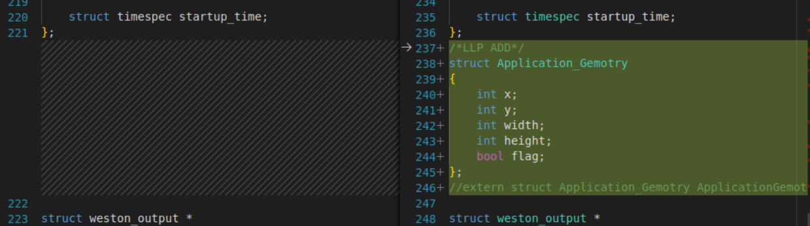
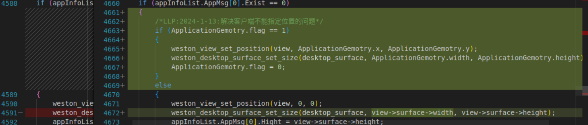

1.创建一个位置自己定义的表面
```c
    struct weston_layer *my_layer = zalloc(sizeof(*my_layer));
	weston_layer_init(my_layer,shsurf->shell->compositor);
    weston_layer_set_position(my_layer,0x40000000);
    struct weston_surface *surface = weston_surface_create(shsurf->shell->compositor);
	weston_surface_set_color(surface,1.0,1.0,1.0,1.0);
	weston_surface_set_size(surface,500,700);
    struct weston_view *view1 = weston_view_create(surface);
    weston_view_set_position(view1, 0,0);
	weston_layer_entry_insert(&my_layer->view_list,&view1->layer_link);
```
2.通过xdg_shell解决客户端指定位置的问题.
    在shell.h 里面定义需要数据交换的结构体，在xdg_shell.c 处理好xdg协议后，将需要交换的数据写入结构体，通过“__attribute__((visibility("default")))” 设置符号可见，让shell.c可以调用。
2-1.shell.h


2-2.shell.c



2-3.xdg_shell.c
```c
struct Application_Gemotry ApplicationGemotry __attribute__((visibility("default"))) = {0};
```
```c
static void
weston_desktop_xdg_surface_protocol_set_window_geometry(struct wl_client *wl_client,
														struct wl_resource *resource,
														int32_t x, int32_t y,
														int32_t width, int32_t height)
{
	struct weston_desktop_surface *dsurface =
		wl_resource_get_user_data(resource);
	struct weston_desktop_xdg_surface *surface =
		weston_desktop_surface_get_implementation_data(dsurface);

	if (!weston_desktop_xdg_surface_check_role(surface))
		return;

	surface->has_next_geometry = true;
	surface->next_geometry.x = x;
	surface->next_geometry.y = y;
	surface->next_geometry.width = width;
	surface->next_geometry.height = height;
	/*LLP ADD*/
	ApplicationGemotry.flag = 1;
	ApplicationGemotry.x = x;
	ApplicationGemotry.y = y;
	ApplicationGemotry.width = width;
	ApplicationGemotry.height = height;
	//printf("LLP:weston_desktop_xdg_surface_protocol_set_window_geometry>\n x = %d,y = %d,width = %d,height = %d", x, y, width, height);
}
```
2-4 高级指定
shell.c :
//注意，在desktop_surface_committed里面加入有关响应，-maybe it's not a good way,客户端使用wl_surface_commit可触发这个回调，注意必须要提交正确的surface才能正常设置
/*绘图关键函数，注意更改部分是为了实时设置窗口位置*/
```c
static void
desktop_surface_committed(struct weston_desktop_surface *desktop_surface,
						  int32_t sx, int32_t sy, void *data)
{
    ...
	/*LLP ADD to change position after initial position*/
	if (ApplicationGemotry.flag == 1)
	{
		weston_log("LLP:desktop_surface_committed>the position change new_x = %d , new_y = %d\n", ApplicationGemotry.x, ApplicationGemotry.y);
		weston_view_set_position(shsurf->view, ApplicationGemotry.x, ApplicationGemotry.y);
		/*change width and height*/
		if (ApplicationGemotry.width > 20 && ApplicationGemotry.height > 20)
			weston_desktop_surface_set_size(desktop_surface, ApplicationGemotry.width, ApplicationGemotry.height);
		/*close flag*/
		ApplicationGemotry.flag = 0;
	}

	if (surface->width == 0)
		return;
    ...
}
```
